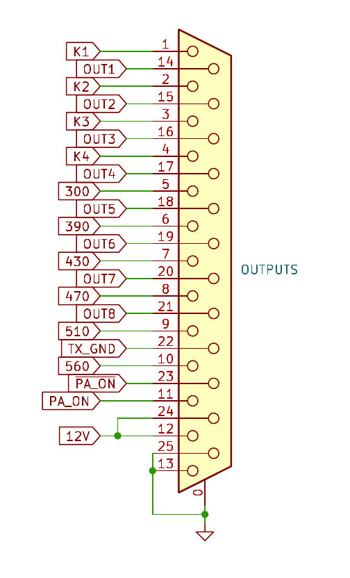
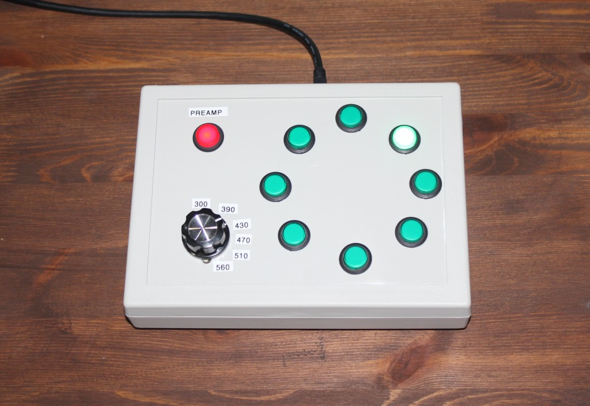
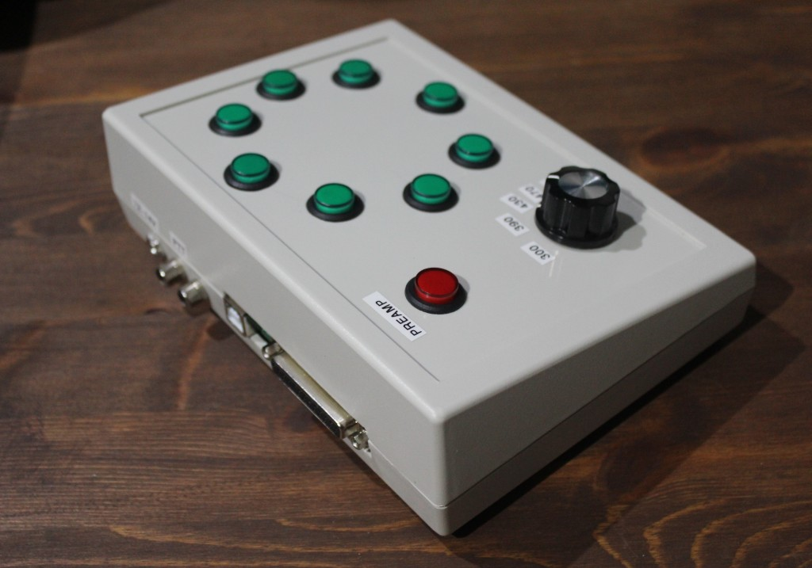
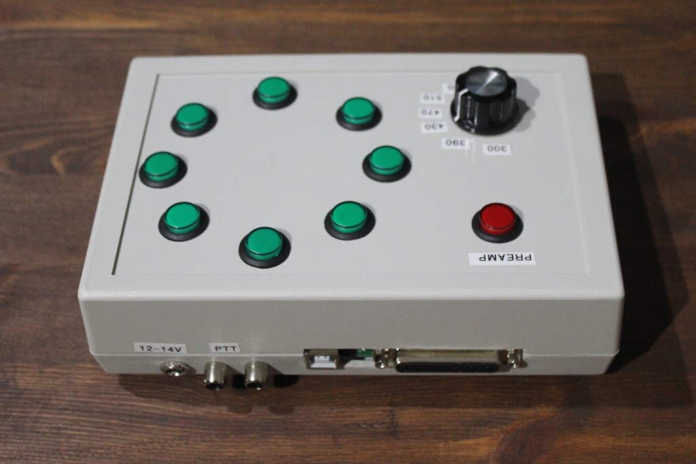
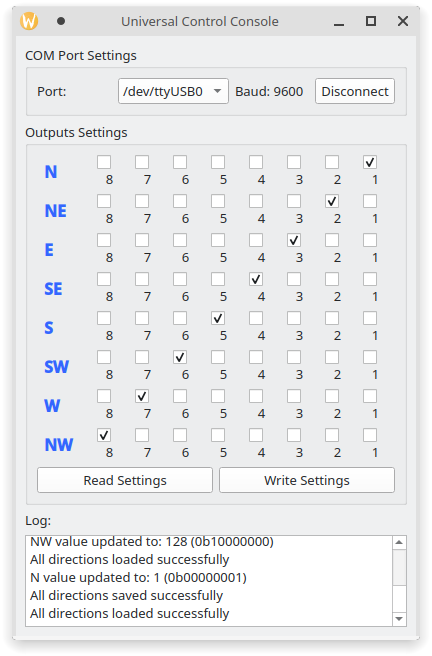

## Universal Control Console (UCC)

The device can control any type of antenna switches. It has 8 independent programmable outputs and also can control [my version of receiving antenna K9AY](https://github.com/ra0sms/K9AY_with_wifi).

More information (in Russian, but Translate button still works) - https://ra0sms.com/ucc/

### [Schematic](KiCad/wired_console_k9ay/wired_console_k9ay.pdf)

### Outputs description

| DB25 pins | Description                                                  |
| --------- | ------------------------------------------------------------ |
| 1         | **K1** - open collector out for K9AY direction control       |
| 2         | **K2** - open collector out for K9AY direction control       |
| 3         | **K3** - open collector out for K9AY direction control       |
| 4         | **K4** - open collector out for K9AY direction control       |
| 5         | **300** - open collector out for K9AY load control           |
| 6         | **390** - open collector out for K9AY load control           |
| 7         | **430** - open collector out for K9AY load control           |
| 8         | **470** - open collector out for K9AY load control           |
| 9         | **510** - open collector out for K9AY load control           |
| 10        | **560** - open collector out for K9AY load control           |
| 11        | **PA_ON** - open collector out for K9AY preamplifier control |
| 12        | **12V** - output voltage (goes directly from power supply connector with the diode protection) |
| 13        | **GND** - Ground                                             |
| 14        | **OUT1** - First programmable output (when activated, has 12V out with fuse protection) |
| 15        | **OUT2** - Second programmable output (when activated, has 12V out with fuse protection) |
| 16        | **OUT3** - Third programmable output (when activated, has 12V out with fuse protection) |
| 17        | **OUT4** - Fourth programmable output (when activated, has 12V out with fuse protection) |
| 18        | **OUT5** - Fifth programmable output (when activated, has 12V out with fuse protection) |
| 19        | **OUT6** - Sixth programmable output (when activated, has 12V out with fuse protection) |
| 20        | **OUT7** - Seventh programmable output (when activated, has 12V out with fuse protection) |
| 21        | **OUT8** - Eighth programmable output (when activated, has 12V out with fuse protection) |
| 22        | **TX_GND** - when PTT activated, has connection to ground    |
| 23        | **$\overline{\text{PAON}}$** - when Preamp button pressed, has 12V out without any protection |
| 24        | **12V** - output voltage (goes directly from power supply connector with the diode protection) |
| 25        | **GND** - Ground                                             |

### Some photos

### GUI software for setting up outputs

You can choose outputs which will be activated when you push the buttons. Just connect USB to PC, choose com port and click Connect button.

[EXE-file (Windows OS)](gui/gui.zip)

[Python Script (Linux OS)](gui/gui.py)

### Antenna rotators emulator

UCC also can work with hamradio software, which use Yaesu rotator protocol. UCC can emulate a rotation at a given angle. You can use it with any supported software. For example [PST Rotator AZ](https://www.pstrotator.com/) and [DXLog](https://dxlog.net/).

### [Video with example or working](https://youtu.be/TXcX0s2ozSk)

